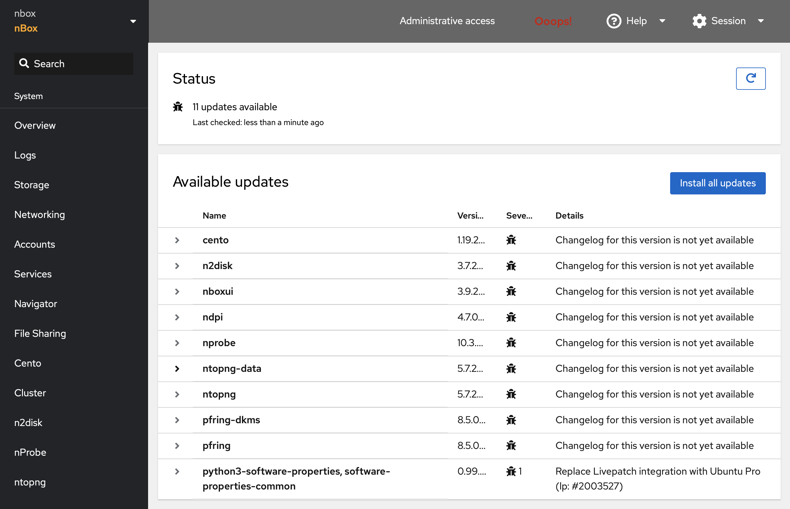

System Updates
==============

The System Updates page allows the administratore to manage updates for all the software, including ntop applications and drivers.

Alternatively it is possible to run updates connecting to the appliance via the Terminal page or SSH and using the standard package manager for the Linux distribution in use.
Example on apt-based systems (Ubuntu/Debian)

.. code-block:: console

   sudo apt-get update
   sudo apt-get upgrade

