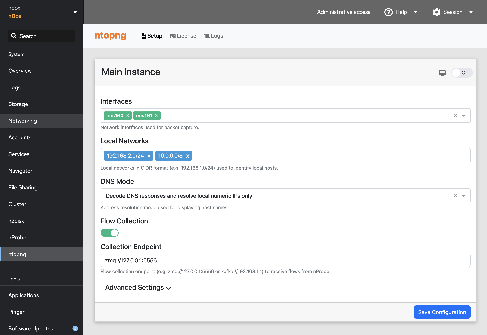
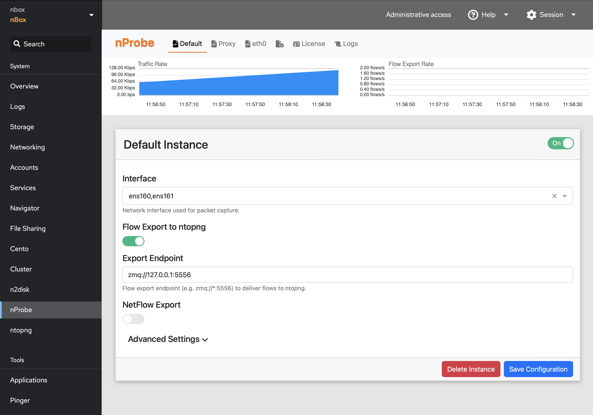
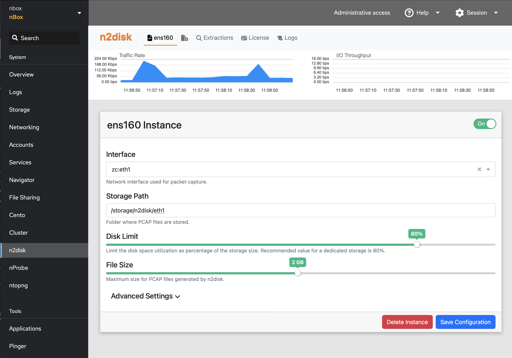
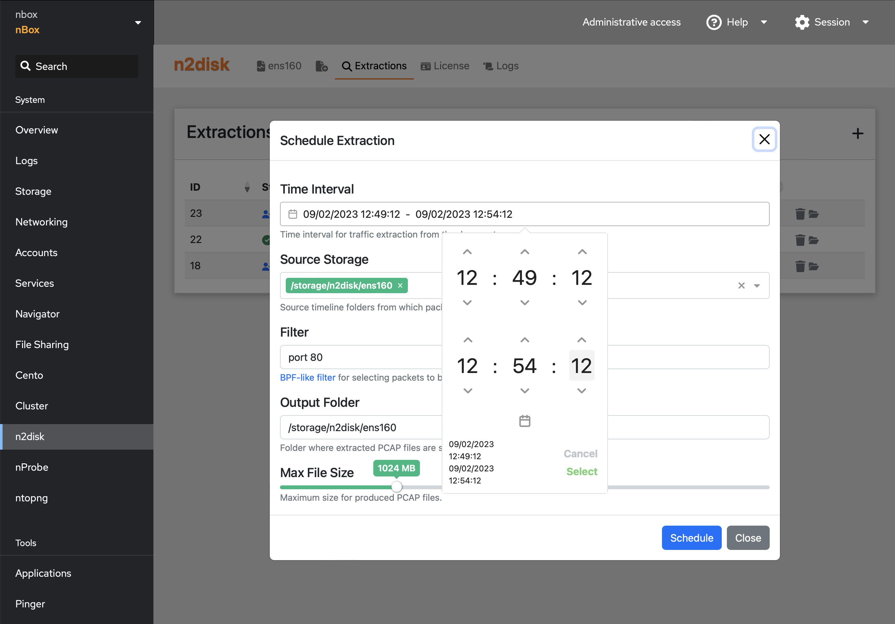
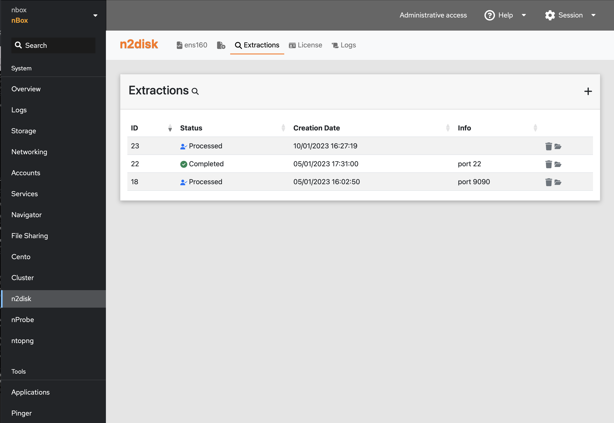

Applications
============

The nBox UI includes a menu entry for each ntop application that it is possible to configure through the Web interdace.
The configuration pages allow the user to customise and control all the ntop applications installed and licensed, by
managing configuration files and systemid services in a way which is fully compatible with manual configurations.

Applications include ntopng, nProbe, nProbe Cento, n2disk. The Cluster is also part of the applications and it is used 
to load balance traffic across application instances, or to send the same traffic to multiple application instances 
(or combinations of both).

ntopng
------

The ntopng page can be used to configure and enable the ntopng application. The page is provided to the user in a tabbed form,
where its first tab is the Setup tab which allows the user to configure ntopng and control the service status. The License
tab allows the user to set and check the License key to unlock Enterprise features. The Logs tab leads to the Logs page where
logs are filtered and only those related to the ntopng service are shown.

In the Setup page, the user should:

1. Check the ntopng settings
2. Change the settings and save them using the Save Configuration button
3. Run the service using the Switch at the top right of the configuration panel

When the switch is set to On, the switch itself is green is the service is up&running, otherwise it is red, meanind that
there is a failure in the service (the Logs can be inspected in that case for more info) or it is still in the startup or
shutdown process (waiting a few seconds should address this if this is the case).

All the physical interfaces are provided in the Interfaces dropdown, those selected will be set in ntopng for capturing
traffic. A Custom Interface option is also available in the dropdows, which allows the user to configure a custom interface
name (this should be used to define logical interfaces, or to attach to a specific interface queue). 
A Flow Collection option is also available to collect flows from probes (nProbe or nProbe Cento), for instance when collecting
NetFlow collector (in this case ntopng does not need to capture packets directly from the network card).

A few more settings are available through the configuration page, such as DNS resolution mode, local network subnets, etc. 
Additional settings can be configured through the Advanced Settings section, using the syntax of the ntopng configuration file.

nProbe
------

Similar to the ntopng page, the nProbe and nProbe Cento pages can be used to configure and control the corresponding applications.
In this case, it is possible to create multiple instances of nProbe, each one with its configuration and service, throuth the Add
Instance button in the top menu.

After creating, configuring and starting an nProbe instance, a chart appear at the top of the page, providing monitoring of
the ingress traffic rate and the flow export rate. This is useful for monitoring the service activity as the service itself
does not provide a GUI.

n2disk
------

The n2disk page can be used to configure multiple n2disk services. Similar to the nProbe configuration page it is in fact
possible to create multiple instances, configure and run them. Some charts are available also in this case, to monitor the
captured traffic and the traffic dumped to disk with the I/O throughput. 

In the configuration section it is possible to select the storage volume for dumping files, set the maximum space to 
be used, the maximum size of each PCAP file dumped on disk. Additional settings (e.g. CPU affinity) can be configured in
the Advanced Settings section.

The Extractions tab allows the user to schedule extraction tasks to retrieve traffic out of all the PCAP files dumped
on disk. A new extraction task can be created by clicking on the + button at the top-right of the panel, and specifying 
the time interval and filter (BPF) to match packets, the source storage (as configured in n2disk), an output folder for the
PCAP files generated, and a maximum size for the ourput files.

After creating a new extraction task, a new entry is added to the Extractions table, where it is possible to check
the extraction status, and jump to the Navigator for downloading the extracted files.

