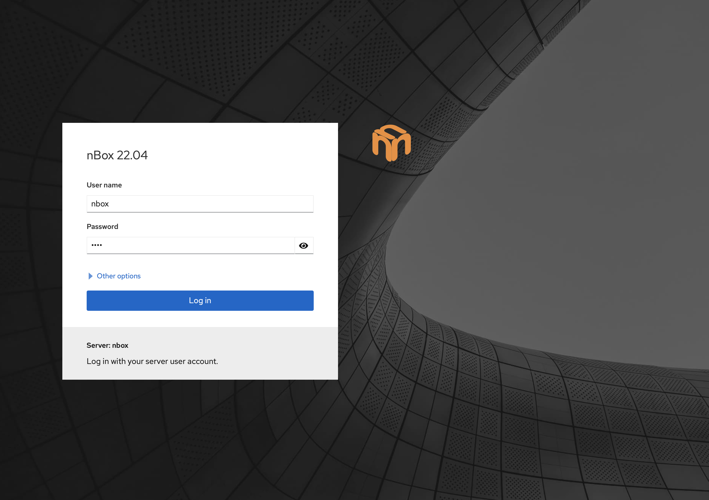
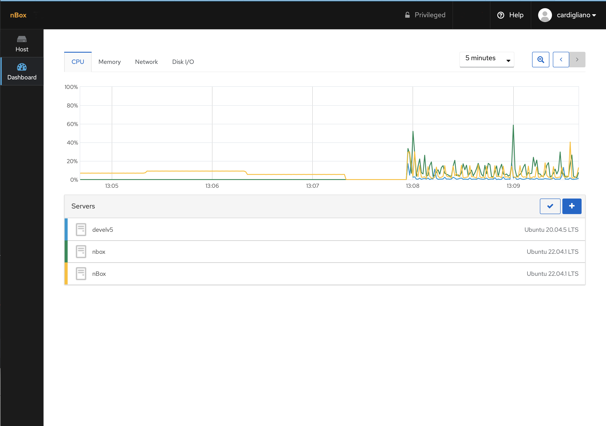

Usage Guidelines
================

Starting using nBox is very simple. Startup the box, plug an Ethernet cable to its management interface 
and connect it to a network. From another PC open a web browser and visit https://192.168.160.10:9090 
(use the default static IP address of the nBox or check the IP address assigned with DHCP).

Clicking on the login button the system will ask for credentials as follows:

If you are using an hardware nBox appliance, the default nBox configuration is the following:

- Default Web user is "nbox" with password "nbox"
- Default SSH user is "nbox" with password "nbox"

IP address and web users can be changed/managed using the web interface.

.. image:: ../img/screenshots/auth.png

Upon the completion of the login process, the user is redirected to the Dashboard page.
CPU, Memory, Nework and Disk I/O indicators are displayed and updated in real time.
It is possible to configure multiple appliances running the nBox UI and show indicators
for all the appliances in the same page.

A side menu is available to jump to the machine and ntop software configuration pages.

.. toctree::
    :maxdepth: 2
    :numbered:

    system
    ssl
    licenses
    applications
    admin
