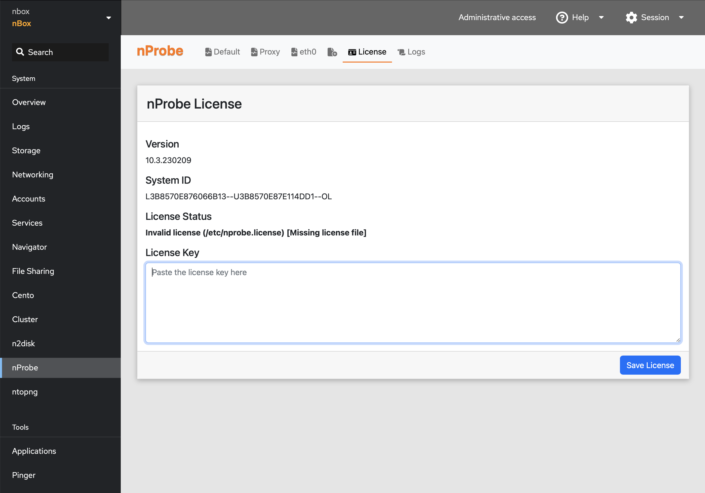

Licenses
========

The ntop software requires a license in order to unlock Enterprise level features.
For instance ntopng comes with a Community mode which is Free and several commercial
modes (Pro, Enterprise M, Enterprise L, ...) that can be unlocked with a license key.

The license can be configured under the product page, that can be selected from the
main menu, under the License tab. This page reports the application version and System 
ID, which are required to generate a license from the shop at http://shop.ntop.org,
and reports the current license status and maintenance.

Note: 

- nBox appliances are usually delivered with all the software installed and licensed, thus there is no need for the user to enable the software in that case.
- License for PF_RING ZC drivers should be manually configured from the Terminal (as well as the driver configuration).

