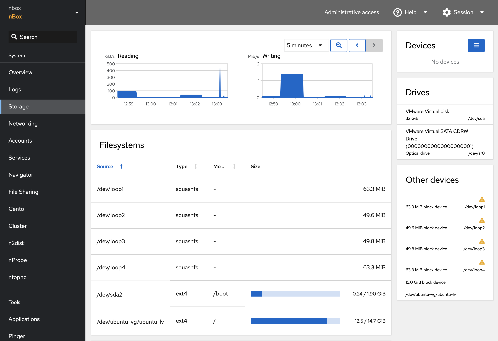
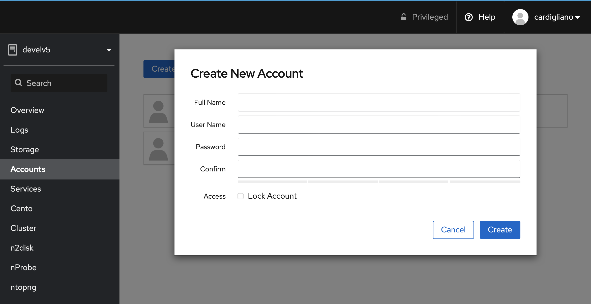
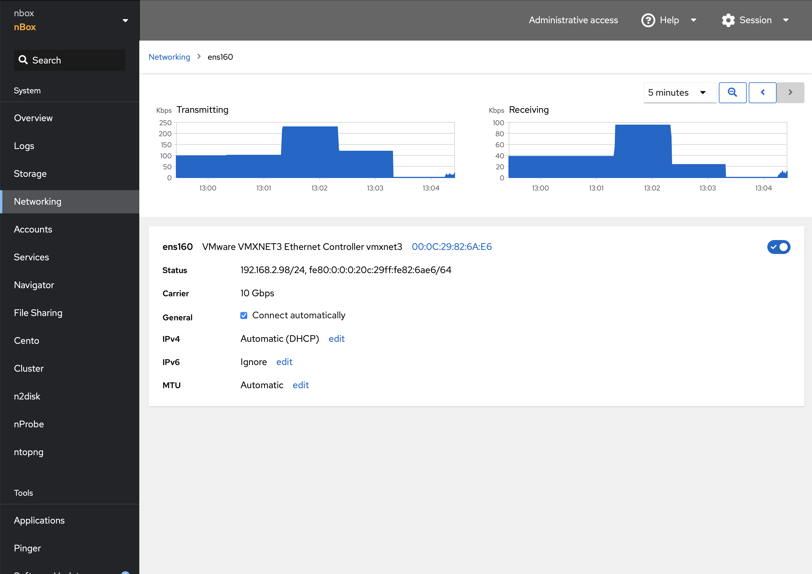

System
======

The nBox UI web interface is based on the Cockpit project, which provides built-in
funcitonalities for monitoring and managing the system.

Overview
--------

The Overview page provides system information including system health, resource utilization and host configuration.

.. image:: ../img/screenshots/overview.png

Storage
-------

The Storage section provides monitoring of the available filesystems/volums and I/O utilization.

Users
-----

The Account page allows the administrator to manage system users. Please note that this interface authenticate the user using
the Linux accounts. The administrator can perform actions such as removing or changing password, or create a new user.

Networking
----------

The Networking page provides statistics about Network interfaces. Here it is possible to configure the management interface,
including the possibility to change the management IP address, using either static ip or DHCP, the DNS servers and gateway.

PF_RING
-------

PF_RING, PF_RING ZC drivers, hugepages and other kernel-related configurations should be configured manually. 
There is a Terminal utility in the sidebar that can be used for this purpose.

.. image:: ../img/screenshots/terminal.png
